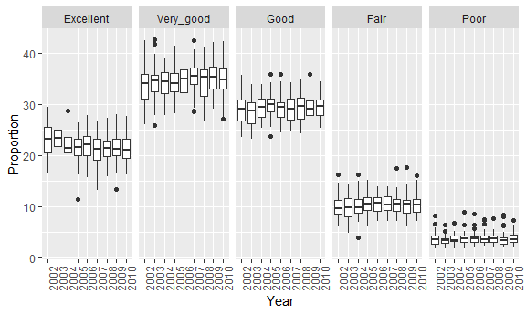
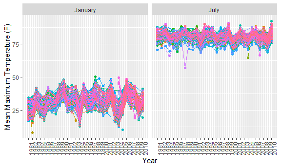

Homework 3 - Visualization
================

Problem 1
=========

First, do some data cleaning by using appropriate variable names, filtering the data based on the “Overall Health” topic, including only responses from “Excellent” to “Poor”, and organizing responses as a factor taking levels ordered from “Excellent” to “Poor”

``` r
library(p8105.datasets)

brfss = brfss_smart2010%>%
  janitor::clean_names()%>%
  filter(topic == "Overall Health", 
         response %in% c("Excellent", "Very good", "Good", "Fair", "Poor"))%>%
  mutate(response = forcats::fct_relevel(response, "Excellent", "Very good", "Good", "Fair", "Poor"))
```

After the data cleaning, begin some exploration:

In 2002, we find that Connecticut, Florida, and North Carolina had observations at 7 different locations. Pennsylvania had observations from the most locations (10), while 13 states had observations from only 1 location.

``` r
filter(brfss, year == 2002)%>%
  distinct(locationabbr, locationdesc)%>%
  count(locationabbr)%>%
  filter(n == 7)%>%
  pull(locationabbr)
```

    ## [1] "CT" "FL" "NC"

Make a “spaghetti plot” that shows the number of observations in each state from 2002 to 2010.

The number of observations remains relatively constant over the years for a majority of the states. However, we observe a massive spike in number of observations during 2007 and 2010

``` r
brfss%>%
  group_by(year)%>%
  distinct(locationabbr, locationdesc)%>%
  count(locationabbr)%>%
  ggplot(aes(x = year, y = n, color = locationabbr)) +
  geom_point() +
  geom_line() +
  labs(
    title = "Number of Observations (2002 to 2010)" ,
    x = "Year",
    y = "Number of Observations"
  )+
  scale_x_continuous(breaks = c(2002:2010))+
  viridis::scale_color_viridis(
    name = "State",
    discrete = TRUE
  ) + 
  theme(legend.position="right")
```


Make a table showing, for the years 2002, 2006, and 2010, the mean and standard deviation of the proportion of “Excellent” responses across locations in NY State.

There is a decrease in mean proportion of "Excellent" responses from 2002 to 2006 and a slight increase in mean proportion from 2006 and 2010. Furthermoe, the standard deviation of the proportion of "Excellent" responses has decreased across the years. A hypothesis test would be needed to evaluate whether the changes are truly significant.

``` r
brfss%>%
  filter(locationabbr == "NY", year %in% c(2002, 2006, 2010))%>%
  select(year, locationabbr, locationdesc, response, data_value)%>%
  spread(key = response, value = data_value)%>%
  group_by(year)%>%
  summarize(Mean = mean(Excellent), SD = sd(Excellent))%>%
  knitr::kable(col.names = c("Year", "Mean", "SD"))
```

|  Year|      Mean|        SD|
|-----:|---------:|---------:|
|  2002|  24.04000|  4.486424|
|  2006|  22.53333|  4.000833|
|  2010|  22.70000|  3.567212|

For each year and state, compute the average proportion in each response category. Then make a five-panel plot that shows, for each response category separately, the distribution of these state-level averages over time.

On average, the "very good" category has the highest proportions in comparison to the other response groups. The "poor" response category has the lowest proportions, on average. Looking at both visuals, there appears to be no overlap between "excellent" and "poor" categories, "fair" and "good" categories, "fair" and "very good" categories, "good" and "poor" categories, as well as "poor" and "very good" categories. Once again, hypothesis testing would be most appropriate to determine whether the differences in the response groups are truly significant. Furthermore, in each response group, the distribution of the boxplots across the years are fairly similar (no outstanding differences), with the occassional outliers.

``` r
average = brfss%>%
  select(year, locationabbr, locationdesc, response, data_value)%>%
  spread(key = response, value = data_value)%>%
  janitor::clean_names()%>%
  group_by(year, locationabbr)%>%
  summarize(Excellent = mean(excellent),
            Very_good = mean(very_good),
            Good = mean(good),
            Fair = mean(fair),
            Poor = mean(poor)
            )%>%
  gather(key = response, value = proportion, Excellent:Poor)%>%
  mutate(response = forcats::fct_relevel(response, "Excellent", "Very_good", "Good", "Fair", "Poor"))

average%>%
  ggplot(aes(x = year, y = proportion, color = locationabbr)) +
  geom_line()+
  facet_grid(~response ) +
  scale_x_continuous(breaks = c(2002:2010))+
  viridis::scale_color_viridis(
    discrete = TRUE
  ) + 
  labs(x = "Year",
       y = "Proportion")+
  theme(legend.position="none",
        axis.text.x = element_text(angle = 90, hjust = 0))
```


``` r
average%>%
  ggplot(aes(x = as.character(year), y = proportion))+
  geom_boxplot()+
  facet_grid(~response)+
  labs(x = "Year",
       y = "Proportion")+
  theme(
        axis.text.x = element_text(angle = 90, hjust = 0))
```



Problem 2
=========

Using the Instacart data, perform some data cleaning and exploration:

``` r
library(p8105.datasets)

instacart_data = instacart

instacart_data = instacart_data%>%
  janitor::clean_names()%>%
  mutate(order_dow = recode(as.character(order_dow), "0" = "Sunday",
                            "1" = "Monday",
                            "2" = "Tuesday",
                            "3" = "Wednesday",
                            "4" = "Thursday",
                            "5" = "Friday",
                            "6" = "Saturday"))
```

Mr. Instacart dataset contains 1384617 observations with 15 variables. The variables are a mix of integers and characters. Each row provides information regarding a specific item in a specific order made. For example the first observation provides information about Bulgarian Yogurt (which was made in order 1) - what day the order was made, whether the item was reordered, what aisle the item is found in, what department the order in, etc.

There are 134 aisles. The aisles with the most items ordered include: fresh vegetables, fresh fruit, packaged vegetables and fruits, yogurt, packaged cheese, water/sparkling water. The fresh vegetables and fruits aisles have a disproportionately higher number of orders than the other top 6 aisles (over 150,000 orders in comparison to less than 80,000 orders).

``` r
aisles=instacart_data%>%
  group_by(aisle)%>%
  summarize(N = n())
  
aisles%>%
  nrow()
```

    ## [1] 134

``` r
aisles%>%
  arrange(desc(N))%>%
  head(6)%>%
  knitr::kable(col.names = c("Aisle","Number of Orders"))
```

| Aisle                         |  Number of Orders|
|:------------------------------|-----------------:|
| fresh vegetables              |            150609|
| fresh fruits                  |            150473|
| packaged vegetables fruits    |             78493|
| yogurt                        |             55240|
| packaged cheese               |             41699|
| water seltzer sparkling water |             36617|

Make a plot that shows the number of items ordered in each aisle. Order aisles sensibly, and organize your plot so others can read it

As mentioned previously, there are certain items that have a disproportionately high number of orders. Therefore, these outliers result in a highly skewed graph, where it is difficult to observe aisles that have less than 20,000 orders.

``` r
aisles%>%
  ggplot(aes(reorder(aisle, desc(N)), N), color = aisle)+
  geom_col()+
  viridis::scale_color_viridis(
    discrete = TRUE) + 
  labs(x = "Aisle Name",
       y = "Number of Items")+
  theme(legend.position = "none",
        axis.text.x = element_text(angle = 90, hjust = 1))
```


Make a table showing the most popular item in each of the aisles “baking ingredients”, “dog food care”, and “packaged vegetables fruits”

In the baking ingredients aisle, light brown sugar has the most number of orders. In the dog food care aisle, snack sticks chicken & rice recipe dog treats have the most popular item. In packaged vegetables and fruits aisle, organic baby spinach is the most popular item. Previously, we discovered that the packaged vegetables and fruits aisle is one of the top 3 most popular aisles. Out of the three popular items, organic baby spinach has the most number of orders.

``` r
instacart_data%>%
  filter(aisle %in% c("baking ingredients", "dog food care", "packaged vegetables fruits"))%>%
  group_by(aisle, product_name)%>%
  summarize(n = n())%>%
  group_by(aisle)%>%
  filter(n == max(n))%>%
  knitr::kable(col.names = c("Aisle", "Item", "Number of Orders"))
```

| Aisle                      | Item                                          |  Number of Orders|
|:---------------------------|:----------------------------------------------|-----------------:|
| baking ingredients         | Light Brown Sugar                             |               499|
| dog food care              | Snack Sticks Chicken & Rice Recipe Dog Treats |                30|
| packaged vegetables fruits | Organic Baby Spinach                          |              9784|

Make a table showing the mean hour of the day at which Pink Lady Apples and Coffee Ice Cream are ordered on each day of the week

The mean hour at which Pink Lady Apples and Coffee Ice Cream are ordered is fairly similar on Sunday, Wednesday, and Saturday. On Monday, Tuesday, Thursday, and Friday, it seems that people order Pink Lady Apples in the late morning hours while people order Coffee Ice Cream in the afternoon times.

``` r
instacart_data%>%
  filter(product_name %in% c("Pink Lady Apples", "Coffee Ice Cream"))%>%
  group_by(product_name, order_dow)%>%
  summarize(Mean_hour = mean(order_hour_of_day))%>%
  spread(key = order_dow, value = Mean_hour)%>%
  knitr::kable(col.names = c("Product Name", "Sunday", "Monday", "Tuesday", "Wednesday", "Thursday", "Friday", "Saturday"))
```

| Product Name     |    Sunday|    Monday|   Tuesday|  Wednesday|  Thursday|    Friday|  Saturday|
|:-----------------|---------:|---------:|---------:|----------:|---------:|---------:|---------:|
| Coffee Ice Cream |  12.26316|  14.31579|  13.83333|   13.77419|  15.21739|  15.38095|  15.31818|
| Pink Lady Apples |  12.78431|  11.36000|  11.93750|   13.44118|  11.55172|  11.70213|  14.25000|

Problem 3
=========

Load the NOAA dataset:

``` r
library(p8105.datasets)

noaa_data = ny_noaa
```

Perform some data cleaning:

Create separate variables for year, month, and day.

``` r
noaa_data = noaa_data%>%
  janitor::clean_names()%>%
  separate(date, into = c("year", "month", "day"), sep = "-")
```

Ensure observations for temperature, precipitation, and snowfall are given in reasonable units.

``` r
noaa_data = noaa_data%>%
  mutate(prcp_in = prcp/(10*25.4), 
         snow_in = snow/25.4,
         snwd_in = snwd/(10*25.4),
         tmax_f = ((as.double(tmax)/10)*9/5)+32,
         tmin_f = ((as.double(tmin)/10)*9/5)+32
         )
```

The NY NOAA dataset has 2595176 observations and 7 variables. The class of the variables are: id as a character, date in date format, precipitation as an integer, snow as an integer, snow depth as an integer, minimum temperature as a character, and maximum temperature as a character. Some interesting aspects of this dataset include definition of temperature as a character, the snow variable has a negative value (-13mm) and the number of missing values. The precipipation variable has 145838 missing entries, the snow variable has 381221 missing entries, the snow depth variable has 591786 missing entries, the tmax variable has 1134358 missing entries, and the tmin variable has 1134420 missing entries

For snowfall, the most commonly observed value is 0.

``` r
noaa_data%>%
  filter(!is.na(snow_in))%>%
  group_by(snow_in)%>%
  summarize(N=n())%>%
  arrange(desc(N))%>%
  head(10)%>%
  knitr::kable(col.names = c("Snow (Inches)", "Number of Observations"))
```

|  Snow (Inches)|  Number of Observations|
|--------------:|-----------------------:|
|      0.0000000|                 2008508|
|      0.9842520|                   31022|
|      0.5118110|                   23095|
|      2.0078740|                   18274|
|      2.9921260|                   10173|
|      0.3149606|                    9962|
|      0.1968504|                    9748|
|      1.4960630|                    9197|
|      0.1181102|                    8790|
|      4.0157480|                    6552|

Make a two-panel plot showing the average max temperature in January and in July in each station across years. Is there any observable structure? Any outliers?

As expected, the mean temperature is higher for the month of July than January. In both months, there are outliers present across the years. It seems as if there are more differences in the distribution of boxplots across the different year in January than in July.

``` r
visual = noaa_data%>%
  select(id, year, month, tmax_f)%>%
  filter(!is.na(tmax_f), month %in% c("01", "07"))%>%
  mutate(month = recode(month, "01" = "January",
                        "07" = "July"))%>%
  group_by(id, month, year)%>%
  summarize(Mean = mean(tmax_f))%>%
  mutate(year = as.integer(year))

visual%>%
  ggplot(aes(x = year, y = Mean, color = id))+
  geom_point()+
  geom_line()+
  facet_grid(~month)+
  viridis::scale_fill_viridis()+
  labs(x = "Year",
       y = "Mean Maximum Temperature (F)")+
  scale_x_continuous(breaks = c(1981:2010))+
  theme(legend.position = "none",
        axis.text.x = element_text(angle = 90, hjust = 0))
```



``` r
visual %>%
  ggplot(aes(x = as.character(year), y = Mean))+
  geom_boxplot()+
  facet_grid(~month)+
   labs(x = "Year",
       y = "Mean Maximum Temperature (F)")+
  theme(axis.text.x = element_text(angle = 90, hjust = 0))
```


Make a two-panel plot showing (i) tmax vs tmin for the full dataset (note that a scatterplot may not be the best option); and (ii) make a plot showing the distribution of snowfall values greater than 0 and less than 100 separately by year.

From the hex plot, we observe that there is a large count for values that are in the (0, 100) part of the tmax and tmin range. From the boxplot, we observe that in each year, there is a number of outliers for the amount of snowfall.

``` r
one = noaa_data%>%
  filter(!is.na(tmin_f), !is.na(tmax_f))%>%
  ggplot(aes(x = tmin_f, y = tmax_f))+
  geom_hex()+
  labs(x = "Minimum Temperature (F)",
       y = "Maximum Temperature (F)")

two= noaa_data%>%
  filter(snow_in > 0 & snow_in < 100)%>%
  ggplot(aes(x = as.character(year),y = snow_in)) + 
  geom_boxplot()+
  labs(x = "Year",
       y = "Snowfall (Inches)")+
  theme(axis.text.x = element_text(angle = 90, hjust = 0))

one+two
```


